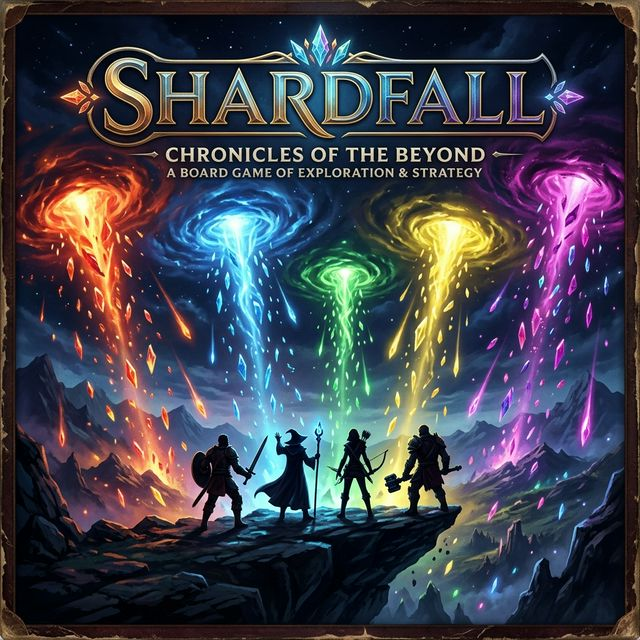
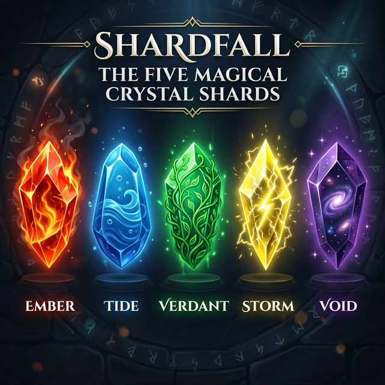
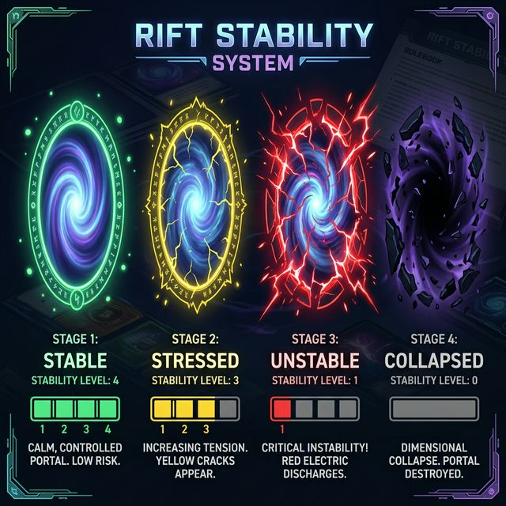
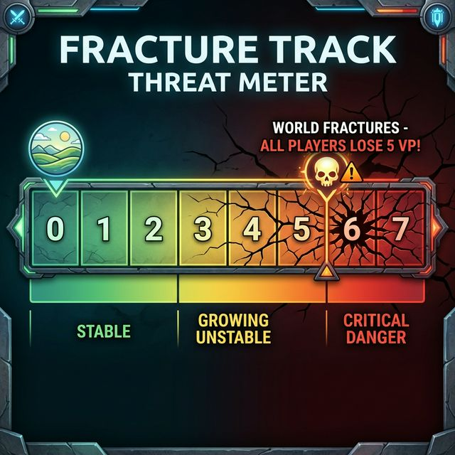
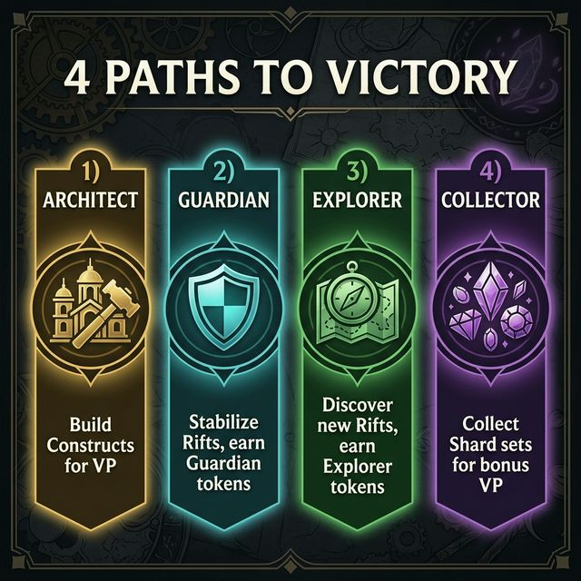

# 💎 SHARDFALL — Chronicles of the Beyond

> *Dimensional rifts are tearing reality apart. Glowing shards rain from the sky. You are a Seeker — will you harvest them for power, or sacrifice them to save the world?*



---

## 📊 At a Glance

| | |
|---|---|
| **Players** | 2–5 |
| **Play Time** | 30–45 minutes |
| **Age** | 10+ |
| **Type** | Card + token strategy with push-your-luck & negotiation |
| **Core Loop** | Gather shards → Build constructs → Manage rift stability |
| **Key Tension** | Personal ambition vs. collective survival |

---

## 🌍 Theme & Setting

Reality is fracturing. Dimensional **Rifts** are opening across the world, dropping magical crystalline **Shards** — fragments of raw dimensional energy. These Shards are immensely powerful and can be used to build wondrous **Constructs**.

But there's a catch: every Rift is unstable. The more you harvest from a Rift, the weaker it gets. When a Rift collapses, the **World Fracture** grows. If too many Rifts collapse, reality itself shatters and **everyone suffers**.

You are a **Seeker** — an adventurer who ventures into Rift Zones to harvest Shards. Your goal: amass the most **Victory Points (VP)** through building, exploring, and protecting the world. But you must balance greed with responsibility, because ignoring the Fracture Track will cost you dearly.

> **🎭 The Core Dilemma:** Every Shard you spend stabilizing a Rift is a Shard you *didn't* spend building a Construct. Every Shard you hoard is one that *could* have saved the world. This tension — the tragedy of the commons — is the heart of SHARDFALL.

---

## 🧩 Components

| Component | Count | Purpose |
|---|---|---|
| 🌀 **Rift Cards** | 20 | Dimensional rifts that produce Shards (4 per type) |
| 🃏 **Anomaly Cards** | 5 | Surprise events shuffled into the Rift deck |
| 💎 **Shard Tokens** | 80 | Resources in 5 colors (16 each) — kept in a draw bag |
| 🏗️ **Construct Cards** | 20 | Projects you build for VP and abilities |
| 🧙 **Seeker Cards** | 8 | Variable player powers |
| 🛡️ **Guardian Tokens** | 15 | Earned by stabilizing Rifts (1 VP each) |
| 🧭 **Explorer Tokens** | 20 | Earned by discovering new Rifts (1 VP each) |
| 📊 **Fracture Track** | 1 | Shared threat meter |
| 🎨 **Player Markers** | 5 | Track who's at which Rift |

---

## 💎 The Five Shard Types

Shards are the lifeblood of the game — you need them for everything. There are 5 types, each linked to a Rift type:



| Shard | Color | Rift Type | Hex |
|---|---|---|---|
| 🔴 **Ember** | Red-Orange | Ember Rifts (volcanic, fiery) | `#e74c3c` |
| 🔵 **Tide** | Deep Blue | Tide Rifts (oceanic, flowing) | `#3498db` |
| 🟢 **Verdant** | Emerald Green | Verdant Rifts (overgrown, wild) | `#27ae60` |
| 🟡 **Storm** | Electric Yellow | Storm Rifts (crackling, volatile) | `#f1c40f` |
| 🟣 **Void** | Deep Purple | Void Rifts (cosmic, mysterious) | `#9b59b6` |

> **💡 Beginner Tip:** Think of Shards as money. You earn them each turn, and you spend them to build things, stabilize rifts, or trade with other players.

---

## 🎬 Game Setup (5 Minutes)

### Step 1: Prepare the Rift Deck
Take all **20 Rift Cards**. Shuffle **5 Anomaly Cards** into the **bottom half** of the Rift deck. Place the deck face-down.

### Step 2: Set Up the Shard Market
Put all **80 Shard Tokens** into the draw bag. Draw **5 Shards** and place them face-up in a row — this is the **Shard Market** (the "shop" everyone draws from).

### Step 3: Lay Out Constructs
Shuffle the **20 Construct Cards**. Deal **4 face-up** in a row — this is the **Construct Display**. Place the rest as a face-down draw pile.

### Step 4: Deal Seeker Powers
Shuffle the **8 Seeker Cards**. Deal **2 to each player**. Each player picks 1 to keep (face-up) and returns the other to the box. Your Seeker is your unique ability for this game.

### Step 5: Set the Fracture Track
Place the **Fracture Track** where everyone can see it. Set the marker to **0**.

### Step 6: Reveal the First Rifts
Flip **2 Rift Cards** from the top of the deck and place them in the center of the table. These are the first active Rifts. Place a stability marker on each (at the number printed on the card — either 2, 3, or 4).

### Step 7: Choose First Player
Pick randomly. The player with the fewest board games at home goes first. 😄

> **📌 Quick Setup Checklist:**
> - ✅ 20 Rift Cards + 5 Anomalies shuffled (Anomalies in bottom half)
> - ✅ Shard bag filled, 5 Shards drawn into the Shard Market
> - ✅ 4 Constructs face-up in the display
> - ✅ Each player has 1 Seeker power card
> - ✅ Fracture Track at 0
> - ✅ 2 starting Rifts revealed
> - ✅ First player chosen

---

## 🔄 How a Round Works

SHARDFALL plays in **rounds**. Each round has 3 phases:

```
┌─────────────────────────────────────────────────┐
│              ROUND STRUCTURE                     │
├─────────────────────────────────────────────────┤
│                                                  │
│  ① RIFTFALL                                      │
│     → Reveal 1 new Rift from the deck            │
│     → (If Anomaly → resolve it, draw again)      │
│                                                  │
│  ② SEEKER TURNS                                  │
│     → Each player takes a turn (clockwise)       │
│     → On your turn: Take 2 ACTIONS               │
│                                                  │
│  ③ STABILITY CHECK                               │
│     → Any Rift at stability 0? → It COLLAPSES    │
│     → Fracture Track increases by 1 per collapse │
│                                                  │
└─────────────────────────────────────────────────┘
```

### Phase 1: RIFTFALL 🌀

Flip the top card of the **Rift Deck**:
- **If it's a Rift Card** → Place it in the play area as a new active Rift. Set its stability marker to the number printed on the card (2, 3, or 4).
- **If it's an Anomaly Card** → Read it aloud, resolve its effect, discard it, then flip the next card to get this round's Rift.

### Phase 2: SEEKER TURNS 🧙

Starting with the first player and going clockwise, each player takes a turn. On your turn, you perform **exactly 2 actions** from the 5 available options. You **may repeat** the same action twice.

*(See the detailed action descriptions in the next section.)*

### Phase 3: STABILITY CHECK 💥

After all players have taken their turns:
- Check every active Rift on the table
- Any Rift with **stability 0** → **COLLAPSES** (remove it from the game)
- For each collapsed Rift, move the **Fracture Track** marker up by **1**

> **💡 Beginner Tip:** The Stability Check is just a quick scan — look at the number on each Rift. If any show 0, they're gone. It takes 5 seconds.

---

## 🎯 Your Turn: Take 2 Actions

On your turn, choose **2 actions** from the following 5 options. You can pick the same action twice!

### The 5 Actions

---

#### 1. 💎 GATHER — Take Shards from the Market

> *Browse the Shard Market and take what you need.*

**How:** Take **any 2 Shard Tokens** from the face-up **Shard Market** (the row of 5 visible Shards). Add them to your personal supply. After taking, **refill** the market back to 5 from the draw bag.

**Why it's smart:** You can see exactly what's available — pick the colors you need for your Constructs. You also deny opponents the Shards they might need.

> **💡 Key Design:** This is **input randomness** — the randomness happens when the market refills (what appears), NOT when you choose. You always make an informed decision.

---

#### 2. ⛏️ EXTRACT — Harvest from a Rift (Risky!)

> *Reach into an unstable dimensional rift and pull out Shards. The rift weakens...*

**How:** Choose any active **Rift Card** on the table. You have two choices:

| Extract Type | Shards Gained | Stability Cost | Risk Level |
|---|---|---|---|
| **Safe Extract** | Take **2 Shards** of that Rift's type from supply | Rift stability **−1** | ⚡ Low |
| **Deep Extract** | Take **4 Shards** of that Rift's type from supply | Rift stability **−2** | 💀 High |

**Bonus:** If you are the **first player to ever Extract from this Rift**, gain **1 Explorer Token** (worth 1 VP at game end)!

**⚠️ Rift Sensitivity Rule (Anti-Runaway Leader):** For every Construct you've built **beyond your 2nd**, ALL your Extracts cost **+1 additional stability**. Leaders drain Rifts faster — the world reacts to their growing power.

| Your Constructs | Extra Stability Cost |
|---|---|
| 0–2 | None |
| 3 | +1 per Extract |
| 4 | +2 per Extract |
| 5+ | +3 per Extract |

> **💡 Strategy Tip:** Early-game Extracts are cheap and safe. Late-game Extracts from a leader can devastate Rifts. This naturally slows down the frontrunner without any "catch-up handout."

---

#### 3. 🏗️ BUILD — Construct Something Powerful

> *Spend your hard-earned Shards to build a Construct — a permanent structure that scores VP and may give you an ongoing ability.*

**How:** Choose a face-up **Construct Card** from the Construct Display. Pay its Shard cost (discard matching Shards to the supply). Place the Construct in front of you. Refill the display from the Construct draw pile.

Each Construct shows:
- **Cost:** Which Shards to pay (e.g., 🔴🔴🔵🟢 = 2 Ember + 1 Tide + 1 Verdant)
- **VP Value:** Victory Points scored at game end (2–8 VP)
- **Ability (optional):** An ongoing power you gain

*(See the full Construct list later in this document.)*

> **💡 Beginner Tip:** Building Constructs is the most straightforward way to score. If you're unsure what to do, gather Shards and build!

---

#### 4. 🛡️ STABILIZE — Save a Rift (and the World)

> *Sacrifice your Shards to reinforce an unstable Rift, preventing collapse and protecting everyone.*

**How:** Spend **2 Shards** (any types) to increase any Rift's **stability by 1**. Gain **1 Guardian Token** (worth 1 VP at game end).

**Rules:**
- A Rift cannot be stabilized above its **printed maximum** (the number on the card)
- You can Stabilize a Rift even if you haven't Extracted from it

> **🎭 The Social Tension:** Stabilizing costs you Shards that could've been spent building Constructs. But if nobody stabilizes, Rifts collapse, Fracture rises, and EVERYONE loses VP. This creates the game's signature "tragedy of the commons" — you need cooperation, but every player is tempted to let someone else do it.

---

#### 5. 🤝 TRADE — Exchange Shards with Others

> *Negotiate with fellow Seekers or exchange with the bank.*

**Two ways to trade:**

| Trade Type | How It Works |
|---|---|
| **Player Trade** | Offer Shards to another player. Negotiate freely — any ratio both agree on. Can include Future Favors ("I'll stabilize next turn if you give me 2 Ember now"). |
| **Bank Trade** | Pay **3 Shards of one type** to receive **1 Shard of any type** from the supply. No negotiation needed. Always available. |

> **💡 Strategy Tip:** Player-to-player trades are WAY more efficient than the 3:1 bank rate. The best negotiators consistently outperform lone wolves. Make deals, keep promises (or don't 😈), and read the table.

---

### Turn Flow Summary

```
┌──────────────────────────────────────┐
│         YOUR TURN BEGINS             │
├──────────────────────────────────────┤
│                                      │
│  ACTION 1 of 2 — Choose one:        │
│  ┌──────────┬──────────┐             │
│  │ 💎 GATHER │ ⛏️ EXTRACT│            │
│  ├──────────┼──────────┤             │
│  │ 🏗️ BUILD │ 🛡️STABILIZE│           │
│  ├──────────┴──────────┤             │
│  │    🤝 TRADE          │            │
│  └─────────────────────┘             │
│                                      │
│  ACTION 2 of 2 — Choose one:        │
│  (same 5 options — can repeat!)      │
│                                      │
├──────────────────────────────────────┤
│         YOUR TURN ENDS               │
│    → Next player clockwise           │
└──────────────────────────────────────┘
```

---

## 💥 Rift Stability — The Push-Your-Luck Engine

Every Rift has a **Stability Level** printed on its card (2, 3, or 4). This represents how stable the dimensional portal is.



### How Stability Changes

| Event | Stability Change |
|---|---|
| Safe Extract by any player | **−1** |
| Deep Extract by any player | **−2** |
| Rift Sensitivity penalty (leader) | **−1** additional per Extract |
| Stabilize action by any player | **+1** (can't exceed printed max) |

### What Happens When Stability Hits 0? 💀

The Rift **COLLAPSES** during the Stability Check phase:
1. ❌ The Rift Card is **removed from the game** permanently
2. 📊 The **Fracture Track** moves up by **1**
3. 😱 Any player who Extracted from this Rift this round loses **1 Shard** of that Rift's type (if they have one) — dimensional backlash

### The Risk-Reward Calculation

> Imagine: There's an Ember Rift at **stability 1**. You need Ember Shards desperately to build your Construct. A **Safe Extract** would give you 2 Ember but drop stability to 0 — the Rift collapses, Fracture goes up, and you take backlash.
>
> Do you Extract? What if another player was planning to Stabilize it? What if they DON'T?
>
> This is the **Stability Threshold** — every Extract near 0 is a calculated gamble about what other players will (or won't) do.

---

## 🌍 The Fracture Track — Shared Threat

The Fracture Track represents the integrity of reality itself. Every time a Rift collapses, Fracture increases. If Fracture reaches the **threshold**, everyone suffers.



### Fracture Threshold (by Player Count)

| Players | Fracture Threshold |
|---|---|
| 2 players | **4** |
| 3 players | **5** |
| 4 players | **6** |
| 5 players | **7** |

### What Happens at the Threshold?

When Fracture reaches the threshold:
- 🚨 The game **ends immediately** (finish the current round)
- 💀 **ALL players lose 5 VP** from their final score
- The player who caused the final collapse loses an **additional 2 VP**

### Why This Matters

Fracture **never decreases**. Every collapse is permanent. The only defense is **prevention** — Stabilize Rifts before they collapse.

This creates a ticking clock of shared danger. Even the most competitive players must cooperate to keep the world alive. A player who ignores stabilization becomes everyone's enemy.

> **💡 Social Dynamic:** "Hey, that Tide Rift is at stability 1 and I can't reach it. Can someone Stabilize it? If it collapses, we're at Fracture 5 and that's only 1 away from the threshold for 3 players..."

---

## 🏗️ Construct Cards — What You Build

Constructs are your main source of VP. There are **20 unique Constructs** divided into three tiers:

### ⭐ Small Constructs (Cost: 3–4 Shards → 2–3 VP)

| Construct | Cost | VP | Ability |
|---|---|---|---|
| **Shard Lens** | 🔴🔴🔵 | 2 | When you Gather, take **3 Shards** instead of 2 |
| **Drift Anchor** | 🟢🟢🟡 | 2 | Your Stabilize actions cost **1 Shard** instead of 2 |
| **Echo Chamber** | 🟣🟣🔴 | 3 | Once per round, peek at the top card of the Rift deck |
| **Trade Post** | 🔵🟢🟡 | 2 | Your bank trades cost **2:1** instead of 3:1 |
| **Warden's Seal** | 🔴🔵🟢🟡 | 3 | No ability — pure VP for diverse Shards |
| **Compass Stone** | 🟣🟣 | 2 | Gain **1 extra Explorer Token** immediately on building |
| **Shard Forge** | 🔴🔴🔴 | 2 | Once per round, convert 1 Shard to any other type |

### ⭐⭐ Medium Constructs (Cost: 5–6 Shards → 4–5 VP)

| Construct | Cost | VP | Ability |
|---|---|---|---|
| **Rift Engine** | 🔴🔴🔵🔵🟣 | 4 | Your Extracts cost **1 less stability** (min 0) |
| **Harmony Spire** | 🟢🟢🟡🟡🔵 | 5 | No ability — pure VP |
| **Void Gate** | 🟣🟣🟣🔴🔵 | 4 | You may Extract from **collapsed** Rift types (gain 1 Shard from supply, no stability impact) |
| **Crystal Bastion** | 🔵🔵🟢🟢🟡🟡 | 5 | Your Shards cannot be targeted by Anomaly Cards |
| **Storm Harvester** | 🟡🟡🟡🔴🟣 | 4 | When any player Deep Extracts from a Storm Rift, you also gain 1 Storm Shard |
| **Alliance Hall** | 🔴🔵🟢🟡🟣 | 5 | No ability — pure VP for having all 5 Shard types |

### ⭐⭐⭐ Large Constructs (Cost: 7+ Shards → 6–8 VP)

| Construct | Cost | VP | Ability |
|---|---|---|---|
| **Nexus Spire** | 🔴🔴🔵🔵🟢🟢🟣 | 7 | When you Stabilize, gain **2 Guardian Tokens** instead of 1 |
| **World Anchor** | 🟡🟡🟡🟡🔴🔴🔵 | 6 | At game end, if Fracture is 2 or below, gain **+4 bonus VP** |
| **Planar Conduit** | 🟣🟣🟣🟣🔵🔵🟢 | 6 | May Extract from **any** Rift type for any Shard color |
| **Dimensional Forge** | 2 of each type (10 total) | 8 | Legendary! The most valuable Construct in the game |
| **Infinity Shard** | Any 8 Shards (your choice) | 6 | Flexible cost — can be built with whatever you have |
| **Guardian Citadel** | 🔵🔵🔵🟢🟢🟢🟣 | 7 | At game end, your Guardian Tokens are worth **2 VP each** instead of 1 |
| **Explorer's Atlas** | 🟡🟡🔴🔴🟢🟢🟣 | 7 | At game end, your Explorer Tokens are worth **2 VP each** instead of 1 |

---

## 🧙 Seeker Powers — Asymmetric Start

At game start, each player gets a unique **Seeker Card** that gives them a passive ability for the entire game. This creates different playstyles and strategic leanings from turn 1.

| Seeker | Power | Strategic Lean |
|---|---|---|
| 🔴 **Ember Seeker** | Your Ember Extracts give **+1 extra Shard** | Aggressive — Extract specialist |
| 🔵 **Tide Seeker** | Once per round, Stabilize for **free** (0 Shards, still get Guardian Token) | Guardian — Stabilize path favored |
| 🟢 **Verdant Seeker** | Your bank trades cost **2:1** | Flexible — easier to get what you need |
| 🟡 **Storm Seeker** | Take **3 actions** per turn (but max 1 Extract) | Fast — more actions, can't spam Extract |
| 🟣 **Void Seeker** | Constructs cost you **1 fewer Shard** (minimum 2) | Architect — Build faster & cheaper |
| 🧭 **Wanderer** | Gain **2 Explorer Tokens** when exploring new Rifts instead of 1 | Explorer — discovery path favored |
| 🛡️ **Sentinel** | When a Rift collapses, you **do not** suffer backlash | Resilient — can play risky near collapse |
| 🤝 **Diplomat** | Once per round, make a **forced 1:1 trade** with any player (they can't refuse) | Social — trading powerhouse |

> **💡 Beginner Tip:** Don't worry about picking the "best" Seeker. They're all balanced. Pick the one that sounds fun to YOU. Your Seeker nudges your strategy, it doesn't lock you in.

---

## 🃏 Anomaly Cards — Surprise Events

**5 Anomaly Cards** are shuffled into the bottom half of the Rift deck, so they appear in the mid-to-late game. When one is flipped during Riftfall, resolve it immediately, then flip the next card for the actual Rift.

| Anomaly | Effect |
|---|---|
| 🌋 **Dimensional Surge** | ALL active Rifts lose **1 stability**. Tension rises for everyone. |
| 🎁 **Shard Rain** | Every player draws **2 random Shards** from the bag. A windfall! |
| 🔄 **Reality Shift** | All Constructs in the display are discarded and replaced with 4 new ones. New options! |
| 💫 **Convergence** | Each player simultaneously and secretly chooses: contribute **2 Shards** (any type) to reduce Fracture by 1 for each contributor, or keep them. Reveal simultaneously. *(Prisoner's dilemma!)* |
| ⚡ **Rift Storm** | The Rift with the **lowest stability** immediately collapses (skip Stability Check for it). If tied, the player with the most VP chooses which one. |

> **🎭 Why Anomalies are in the Bottom Half:** The early game is for learning and expansion. Anomalies inject drama in the mid-to-late game when the stakes are higher and players are more invested. This creates a natural narrative arc.

---

## 🏆 End Game & Scoring

### When Does the Game End?

The game ends when **any** of these triggers occur (finish the current round so all players get equal turns):

| Trigger | What Happened |
|---|---|
| 🏗️ **5th Construct** | Any player builds their 5th Construct → finish the round |
| 💀 **Fracture Threshold** | Fracture Track reaches the threshold → finish the round |
| 🌀 **Rift Deck Empty** | No more Rift Cards to flip → finish the round |

### How to Score



| Category | Points | How to Earn |
|---|---|---|
| 🏗️ **Construct VP** | 2–8 per Construct | Build Constructs (VP printed on card) |
| 🛡️ **Guardian Tokens** | 1 VP each | Earn by Stabilizing Rifts |
| 🧭 **Explorer Tokens** | 1 VP each | Earn by being first to Extract from a new Rift |
| 💎 **Shard Sets** | See table below | Collect diverse Shards remaining at game end |
| 👑 **Most Guardians Bonus** | +5 VP | Player with the most Guardian Tokens |
| 🗺️ **Most Explorers Bonus** | +5 VP | Player with the most Explorer Tokens |
| 💀 **Fracture Penalty** | −5 VP (all players) | If game ended due to Fracture threshold |
| 💀 **Last Collapse** | −2 VP (one player) | Player who caused the final collapse |

### Shard Set Scoring (Collector Path)

At game end, count your **remaining Shards** (ones you didn't spend):

| Set | Bonus VP |
|---|---|
| 1 of each color (5 different) | **+3 VP** |
| 2 of each color (10 different) | **+8 VP** |
| Any 3 of the same color | **+1 VP** per set |

### Scoring Example

> **🧙 Alice (Void Seeker):**
> - Built 4 Constructs: 3 + 4 + 5 + 7 = **19 VP**
> - 3 Guardian Tokens = **3 VP**
> - 2 Explorer Tokens = **2 VP**
> - Has 1 of each Shard color remaining = **+3 VP**
> - Has the most Guardian Tokens = **+5 VP** bonus
> - Fracture didn't reach threshold = **no penalty**
> - **Total: 32 VP** ✅
>
> **⚡ Bob (Storm Seeker):**
> - Built 3 Constructs: 2 + 5 + 6 = **13 VP**
> - 6 Guardian Tokens = **6 VP** (he focused on stabilizing!)
> - 5 Explorer Tokens = **5 VP** (he explored every Rift type!)
> - Most Explorers = **+5 VP** bonus
> - 2 of each Shard color = **+8 VP**
> - **Total: 37 VP** ✅ ← **Bob wins!**
>
> *Bob built fewer Constructs but won through Guardian + Explorer + Collector paths!*

---

## 🗺️ The 4 Paths to Victory

This is what makes SHARDFALL deeply strategic. There is **no single winning formula**. Instead, there are 4 overlapping paths, and the best players blend them based on what's available.

### Path 1: 🏗️ THE ARCHITECT
> *Build the most Constructs. Pure VP from construction.*

**Strategy:** Focus on Gathering and Extracting to collect Shards, then Build as fast as possible. Aim for Large Constructs (6-8 VP each).

**Risk:** The **Rift Sensitivity** penalty makes your Extracts increasingly costly. After your 3rd Construct, you drain Rifts faster, making you unpopular at the table.

**Best Seeker:** 🟣 Void Seeker (cheaper builds) or 🟡 Storm Seeker (more actions to gather)

---

### Path 2: 🛡️ THE GUARDIAN
> *Stabilize Rifts, collect Guardian Tokens, win through protection.*

**Strategy:** Spend Shards Stabilizing instead of Building. Each Stabilize earns a Guardian Token (1 VP). Aim for the **Most Guardians bonus (+5 VP)**. Build Guardian Citadel (makes tokens worth 2 VP each!).

**Risk:** You score slower per action than Architects. You're investing in a scaling strategy — it pays off big late-game.

**Best Seeker:** 🔵 Tide Seeker (free Stabilize per round) or 🛡️ Sentinel (safe near collapsing Rifts)

---

### Path 3: 🧭 THE EXPLORER
> *Discover every Rift first, collect Explorer Tokens.*

**Strategy:** Be the first to Extract from new Rifts (earn Explorer Tokens). Rush to Extract from each new Rift as soon as it appears. Aim for **Most Explorers bonus (+5 VP)**. Build Explorer's Atlas (doubles token value!).

**Risk:** You spread thin — extracting small amounts from many Rifts instead of focusing.

**Best Seeker:** 🧭 Wanderer (2 Explorer Tokens per new Rift) or 🟡 Storm Seeker (3 actions = reach new Rifts faster)

---

### Path 4: 💎 THE COLLECTOR
> *Hoard diverse Shards, score through set collection.*

**Strategy:** Gather widely, keep Shards instead of spending them. Aim for 2 of each color (+8 VP). Use bank trades or the Trade Post Construct to convert types.

**Risk:** You're not building Constructs, so your visible VP looks low. Opponents might not see you as a threat until it's too late. But you have fewer abilities and less board presence.

**Best Seeker:** 🟢 Verdant Seeker (2:1 bank trades) or 🤝 Diplomat (forced trades to get what you need)

---

### Blended Strategies (the real mastery)

The best players don't pick ONE path — they **adapt**. Start as an Explorer, transition to Architect once you've claimed discovery tokens. Go Guardian early, then pivot to Collector when you've accumulated enough tokens.

> **💡 This is "easy to learn, hard to master"** — a beginner can just Build things and have fun. A veteran reads the table, watches what paths opponents commit to, and navigates toward the least contested path.

---

## 🧠 Design Philosophy: How SHARDFALL Solves the 8 Problems

This section explains the intentional design behind every mechanic.

### 1. 🏃 Runaway Leader → **Rift Sensitivity**

| Problem | Solution |
|---|---|
| In most games, whoever gets ahead stays ahead | **Rift Sensitivity** — for every Construct beyond your 2nd, Extracts cost +1 stability. Leaders drain Rifts faster, making them costly to the whole table. Leaders naturally slow down. |

The leader doesn't get "punished" — they just face rising costs. It feels like a natural consequence, not an artificial handicap.

### 2. 😤 Frustrating Loss → **4 Scoring Paths + Shared Stakes**

| Problem | Solution |
|---|---|
| Losing a game you invested 40 minutes in feels terrible | **Multiple scoring paths** mean you almost always achieved SOMETHING (most explorations, most stabilizations, a cool Construct combo). The **semi-cooperative Fracture** system means "we survived" is a shared accomplishment even in loss. |

You always walk away with a story: "I was the one who saved the Tide Rift from collapsing 3 times!" Even 2nd place feels like an achievement.

### 3. 🤝 Player Interaction → **Trading + Fracture Negotiation + Pact Dynamics**

| Problem | Solution |
|---|---|
| Many strategy games are "multiplayer solitaire" | **Trading** is always better than banking (negotiation). **Fracture management** requires constant conversation ("Who's going to Stabilize?"). **Anomaly: Convergence** is a literal prisoner's dilemma. You MUST talk to other players to succeed. |

### 4. ♻️ High Replayability → **Modular Everything**

| Problem | Solution |
|---|---|
| Games get stale after 5-10 plays | **Randomized Rift order** (different world each game). **Random Shard Market** (different economy each turn). **Variable Seeker powers** (different playstyle each game). **20 unique Constructs** (only 4 visible at a time). **Anomaly timing** (different drama each game). |

No two games of SHARDFALL play the same way.

### 5. 📚 Easy to Learn, Hard to Master → **5 Simple Actions, Infinite Depth**

| Problem | Solution |
|---|---|
| Complex games scare away new players; simple games bore veterans | **Core loop is dead simple**: on your turn, pick 2 of 5 actions. A beginner can play by just Gathering and Building. **Depth emerges** from timing (when to Extract vs. Stabilize), negotiation (what trades to make), reading opponents (what path are they on?), and Rift management (push-your-luck). |

Teach the game in 5 minutes. Explore its strategic depth over 50+ plays.

### 6. 🗺️ Multiple Paths + Shared Incentives → **4 Victory Paths + Fracture Track**

| Problem | Solution |
|---|---|
| One dominant strategy makes games feel "solved" | **4 distinct victory paths** (Architect, Guardian, Explorer, Collector) ensure there's always an under-contested path to pursue. **Fracture Track** creates a shared incentive — you MUST cooperate on stabilization, even while competing on everything else. |

### 7. 🎲 Input Randomness → **Visible Shard Market + Known Rifts**

| Problem | Solution |
|---|---|
| Dice rolls and hidden draws feel unfair ("I lost because of bad luck") | **Shard Market is face-up** — you see what's available before choosing. **Rifts are revealed** before you act. **Anomalies are known** to be in the bottom half. Randomness determines your OPTIONS, not your OUTCOMES. You always choose. |

No dice. No "roll to succeed." Every outcome is the result of a decision you made with available information.

### 8. ⚖️ Stability Threshold (Risk-Reward) → **Rift Stability System**

| Problem | Solution |
|---|---|
| Games lack tension because actions are always "safe" | **Every Extract degrades a Rift's stability.** Extracting from a Rift at stability 1 is a calculated gamble — you get Shards, but the Rift might collapse. **Deep Extract** doubles the reward AND the risk. The **Stability Threshold** moment (stability = 1) is pure adrenaline. |

The risk isn't forced on you — you CHOOSE to push your luck. That makes it exciting, not frustrating.

---

## 📐 Quick Reference Card

### Setup
```
1. Shuffle 20 Rifts + 5 Anomalies (Anomalies in bottom half)
2. Fill Shard bag (80 tokens), draw 5 → Shard Market
3. Shuffle Constructs, reveal 4 → Construct Display
4. Deal 2 Seekers each, keep 1
5. Fracture Track → 0
6. Reveal 2 starting Rifts
7. Pick first player
```

### Round Flow
```
① RIFTFALL   → Flip 1 Rift card (Anomaly? → Resolve + flip again)
② TURNS      → Each player: 2 actions (clockwise)
③ STABILITY  → Stability 0? → Collapse → Fracture +1
```

### Your Turn = 2 Actions (pick any, can repeat)
```
💎 GATHER     → Take 2 Shards from the Shard Market
⛏️ EXTRACT    → Take 2 Shards from a Rift (stability −1)
                OR Deep Extract: 4 Shards (stability −2)
🏗️ BUILD      → Spend Shards → play a Construct card
🛡️ STABILIZE  → Spend 2 Shards → Rift stability +1, gain 1 Guardian Token
🤝 TRADE      → Player trade (any agreed ratio) or bank (3:1)
```

### Rift Sensitivity (Anti-Runaway)
```
0-2 Constructs built  →  No penalty
3 Constructs          →  Extracts cost +1 stability
4 Constructs          →  Extracts cost +2 stability
5+ Constructs         →  Extracts cost +3 stability
```

### Game End (any trigger, finish round)
```
🏗️ Any player builds 5th Construct
💀 Fracture reaches threshold (2p:4 / 3p:5 / 4p:6 / 5p:7)
🌀 Rift deck runs out
```

### Scoring
```
🏗️ Constructs           →  VP printed on card (2-8 each)
🛡️ Guardian Tokens       →  1 VP each (most = +5 bonus)
🧭 Explorer Tokens       →  1 VP each (most = +5 bonus)
💎 Shard Sets            →  1 of each color = +3 / 2 of each = +8
💀 Fracture penalty      →  −5 VP all / −2 VP final collapse cause
```

---

## 🎮 First Game Tips for New Players

1. **Your first game:** Just focus on Gathering and Building. Don't worry about optimal plays.
2. **Watch the Fracture Track.** If it's getting high, everyone should Stabilize.
3. **Trade with other players.** It's almost always better than the 3:1 bank rate.
4. **Don't hoard Shards too long.** They're more valuable as Constructs.
5. **Pay attention to what others are building.** If everyone is racing on the Architect path, switch to Guardian or Explorer.
6. **Have fun with the negotiation.** "I'll Stabilize that Rift if you give me 1 Ember" is a perfectly valid deal.

---

## 🔧 Variants & Modules

### 🌱 Beginner Mode
- Remove Anomaly Cards (simpler)
- Ignore Rift Sensitivity rule (less to track)
- Bank trades at 2:1 instead of 3:1 (easier to get what you need)

### ⚡ Speed Mode (20 minutes)
- Start with 3 Rifts instead of 2
- Reveal 2 Rifts per Riftfall instead of 1
- Game ends at 4th Construct instead of 5th

### 🤝 2-Player Duel
- Start with 4 Rifts instead of 2
- Each player takes 3 actions per turn
- Fracture threshold = 4
- Remove Diplomat and Alliance-based Seekers

### 🏆 Competitive Mode
- No player-to-player trading allowed
- Bank trades at 4:1
- Fracture threshold −1 (tighter margin, more stressful)

---

## 📎 Document Info

| | |
|---|---|
| **Game** | SHARDFALL — Chronicles of the Beyond |
| **Version** | 1.0 — Initial Design |
| **Players** | 2–5 |
| **Duration** | 30–45 minutes |
| **Type** | Card + token strategy / push-your-luck / negotiation |
| **Images** | `shardfall_images/` directory |

---

*SHARDFALL was designed from the ground up to solve 8 core problems in modern board game design. Every mechanic exists for a reason. Playtest it, break it, and make it better.*
