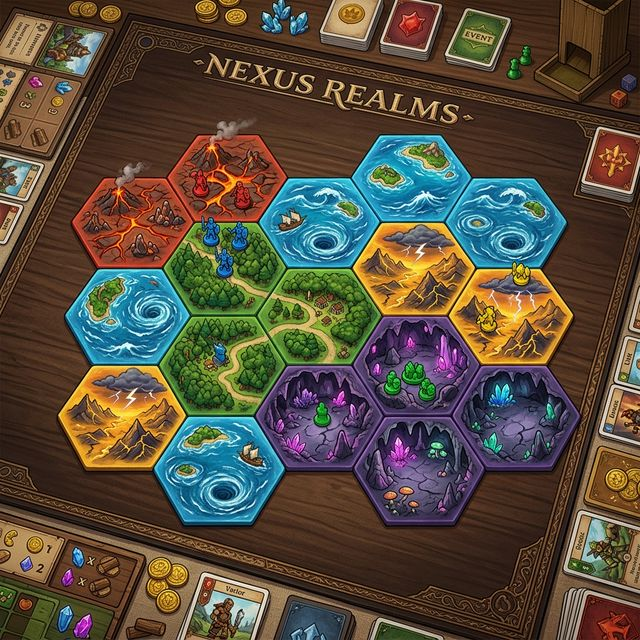
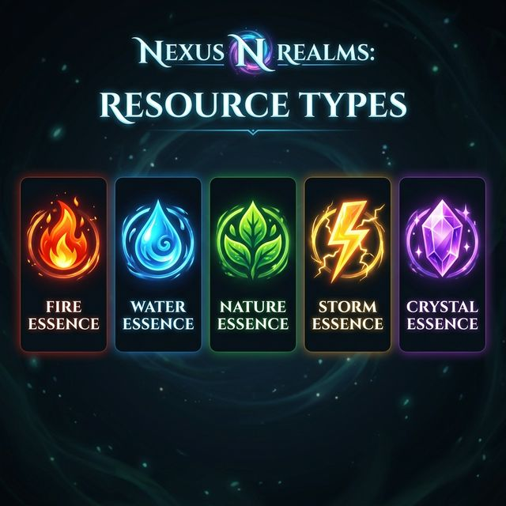
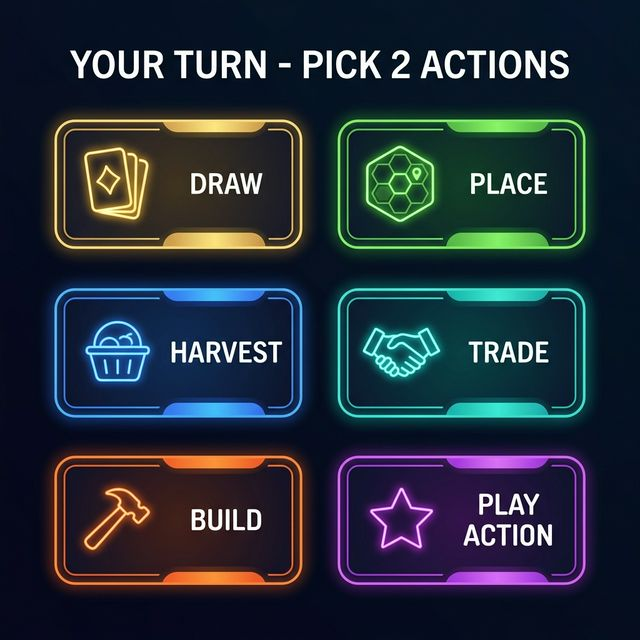
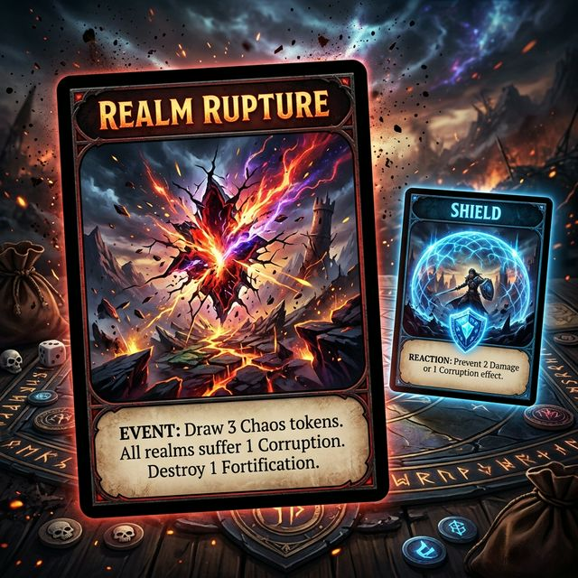
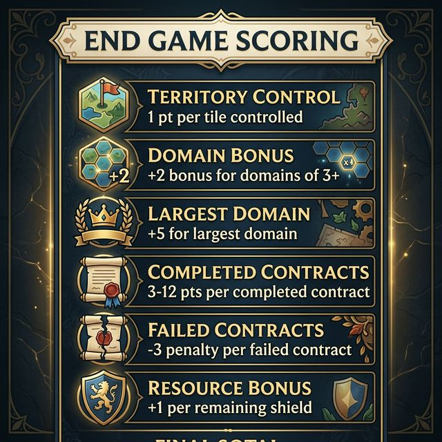

# 🌍 NEXUS REALMS — Game Design Document

> *A card-based strategy game where you build a world, claim territory, collect resources, and complete secret missions — all while surviving chaotic realm ruptures.*

---

## 📖 What Is Nexus Realms?

**Nexus Realms** is a competitive strategy board game where **2–5 players** race to build and control territory on a shared map, collect resources, and fulfill secret contract objectives — all in **30–45 minutes**.

There is **no fixed board**. Instead, players *build the map themselves* by playing hexagonal terrain cards to the table. Every game creates a completely different world.

Think of it as:
- 🗺️ **Catan's** resource collecting and trading
- 🚂 **Ticket to Ride's** secret objectives
- 💣 **Exploding Kittens'** chaotic danger cards

...all blended into one fast, strategic experience.



---

## 🎯 How Do You Win?

The player with the **most points** at the end wins. You earn points by:
- **Controlling territory** (realm cards on the map)
- **Building connected domains** (groups of same-terrain tiles)
- **Completing secret contracts** (hidden objectives only you know)

The game ends when the **deck runs out** or someone controls **15+ tiles**.

---

## 🧩 Game Components

Here's everything in the box (or on screen, for digital play):

| Component | Count | What It Does |
|---|---|---|
| 🗺️ **Realm Cards** | 60 | Hexagonal terrain tiles you place to build the map (12 per terrain type) |
| ⚡ **Action Cards** | 40 | Special power cards that give you tactical advantages |
| 💥 **Rupture Cards** | 10 | Danger cards! — bad events that trigger when drawn |
| 🛡️ **Shield Cards** | 8 | Protection cards — block rupture events |
| 📜 **Contract Cards** | 30 | Secret objectives worth bonus points at game end |
| 💎 **Essence Tokens** | ∞ | Resources you collect (5 types, one per terrain) |

---

## 🌋 The Five Terrains & Essences

Each terrain type on the map produces a matching **essence** (resource). Essences are the currency you spend to expand your territory.



| Terrain | Essence | Visual | Hex Color |
|---|---|---|---|
| **Volcano** 🌋 | 🔥 Fire | Red-orange lava fields | `#e74c3c` |
| **Ocean** 🌊 | 💧 Water | Blue seas and coastlines | `#3498db` |
| **Forest** 🌲 | 🌿 Nature | Lush green woodlands | `#27ae60` |
| **Stormlands** ⛈️ | ⚡ Storm | Electrified, windy mesas | `#f39c12` |
| **Cavern** 💎 | 🔮 Crystal | Underground crystal caves | `#9b59b6` |

> **💡 Beginner Tip:** Think of essences like "money" — you earn them from tiles you control and spend them to claim new tiles.

---

## 🎬 Game Setup (5 Minutes)

Follow these steps to start a game:

### Step 1: Build the Deck
Shuffle all **Realm Cards** (60), **Action Cards** (40), **Rupture Cards** (10), and **Shield Cards** (8) together into one big **Main Deck** (118 cards total).

### Step 2: Deal Starting Hands
Deal **5 cards** from the Main Deck to each player. Then give each player **1 extra Shield Card** (from a separate pile) — everyone starts with guaranteed protection.

### Step 3: Deal Secret Contracts
Deal **3 Contract Cards** face-down to each player. Each player looks at their contracts privately and **keeps at least 2** (discarding the rest to the bottom of the contract deck).

### Step 4: Place the Starting Tile
Flip **1 Realm Card** from the top of the Main Deck and place it in the center of the table. This is the seed of the map — everything builds outward from here. No one controls this tile.

### Step 5: Determine First Player
Pick randomly (youngest player, roll a die, draw highest card, etc.).

> **📌 Quick Setup Checklist:**
> - ✅ Main Deck shuffled (Realm + Action + Rupture + Shield)
> - ✅ 5 cards dealt to each player
> - ✅ 1 bonus Shield given to each player
> - ✅ 3 Contracts dealt, each player keeps ≥2
> - ✅ 1 starting tile in center
> - ✅ First player chosen

---

## 🔄 How a Turn Works

On your turn, you **must perform exactly 2 actions**. You can pick any two from the list below — and yes, you can pick the same action twice!



---

### The 6 Possible Actions

#### 1. 🃏 DRAW — Draw a Card
> *Pull the top card from the Main Deck and add it to your hand.*

⚠️ **Danger!** If you draw a **Rupture Card**, it triggers immediately (see [Rupture Events](#-rupture-events--the-chaos-element) below). You don't get to add it to your hand — you must deal with it right away.

#### 2. 🗺️ PLACE — Play a Realm Card
> *Play a Realm Card from your hand onto the map.*

**Rules for placing:**
- The card must touch **at least 1 existing card** on the map (connect it to the growing world)
- When you Place a Realm Card, **you control it** — mark it with your player color
- If your new tile is the same terrain as adjacent tiles you control, they form a **Domain** (connected group — important for scoring!)

#### 3. 🌾 HARVEST — Collect Resources
> *Gather 1 essence from each Realm Card you control.*

For example, if you control 2 Volcanoes and 1 Forest, you collect 2 🔥 Fire + 1 🌿 Nature.

> **💡 Beginner Tip:** Harvest is how you "earn money." The more tiles you control, the more resources you get each time you harvest.

#### 4. 🤝 TRADE — Exchange Resources
> *Swap essences with another player (if they agree) or trade with the bank.*

Two ways to trade:
- **Player Trade:** Negotiate freely with any player. Both must agree on the exchange.
- **Bank Trade:** Pay any **3 essences of one type** to receive **1 essence of any type**. No negotiation needed.

#### 5. 🔨 BUILD — Claim a Tile
> *Spend essences to take control of an unclaimed tile on the map.*

**Cost:** 2 matching essences + 1 of any type.

**Example:** To claim an unclaimed Forest tile, pay 🌿🌿 + any 1 other essence.

**Rules:**
- The tile must be **unclaimed** (no one controls it yet)
- The tile must be **adjacent** to a tile you already control (you're expanding your territory)

#### 6. ⚡ PLAY ACTION — Use a Special Card
> *Play an Action Card from your hand for its effect.*

Action Cards give you tactical powers like peeking at the deck, stealing resources, or protecting your territory. See the [full list of Action Cards](#-action-cards--your-tactical-toolbox) below.

---

### Turn Flow Summary

```
┌─────────────────────────────────────────┐
│           YOUR TURN BEGINS              │
├─────────────────────────────────────────┤
│                                         │
│   Choose ACTION 1 of 2                  │
│   ┌──────┬──────┬─────────┐             │
│   │ Draw │Place │ Harvest │             │
│   ├──────┼──────┼─────────┤             │
│   │Trade │Build │  Play   │             │
│   │      │      │ Action  │             │
│   └──────┴──────┴─────────┘             │
│                                         │
│   Choose ACTION 2 of 2                  │
│   (same options — can repeat)           │
│                                         │
├─────────────────────────────────────────┤
│          YOUR TURN ENDS                 │
│     → Next player clockwise             │
└─────────────────────────────────────────┘
```

---

## 💥 Rupture Events — The Chaos Element

Ruptures are the game's built-in chaos system. They keep things tense and prevent any single player from running away with the lead.



### What Happens When You Draw a Rupture Card?

**It triggers immediately.** You have two choices:

**Option A: Play a Shield 🛡️**
- Discard a Shield Card from your hand
- The Rupture is neutralized — discard it
- You're safe! (But you now have one fewer Shield for later...)

**Option B: Suffer the Penalty 💀**
If you can't (or choose not to) play a Shield:
1. **Lose 1 territory** — an opponent chooses one of your controlled tiles. You lose control of it.
2. **Lose 2 essences** — you choose which ones to discard.
3. **Lose 1 card** — discard 1 random card from your hand.

> **💡 Strategy Tip:** Don't blow your Shields early! With 10 Ruptures in the deck, the odds of drawing one increase as the game goes on. Holding at least 1 Shield as insurance is usually smart.

> **💡 Beginner Tip:** Ruptures feel harsh, but they're what make the game exciting. They punish greedy expansion and keep every player in the race.

---

## ⚡ Action Cards — Your Tactical Toolbox

There are **40 Action Cards** of **12 different types** shuffled into the Main Deck. Playing one costs 1 of your 2 actions per turn.

### Offensive Cards (attack / disruption)

| Card | Effect | Count |
|---|---|---|
| 🗡️ **Sabotage** | Force another player to discard 1 random card | 4 |
| 💰 **Ambush** | Steal 1 essence from a target player | 4 |
| 🌀 **Essence Storm** | All players pass 1 essence to the player on their left | 3 |
| 🔍 **Insight** | Look at another player's secret Contract Cards | 2 |

### Defensive Cards (protect yourself)

| Card | Effect | Count |
|---|---|---|
| 🏰 **Fortify** | Your tiles cannot be stolen or affected this round | 3 |

### Utility Cards (strategy / map control)

| Card | Effect | Count |
|---|---|---|
| 🔭 **Scout** | Peek at the top 3 cards of the deck, rearrange them in any order | 4 |
| 🌍 **Terraform** | Change the terrain type of 1 unclaimed Realm Card on the map | 3 |
| 🌀 **Portal** | Teleport one of your tiles to any valid empty position on the map | 3 |
| 🔀 **Realm Swap** | Swap the positions of 2 adjacent unclaimed Realm Cards | 3 |
| 🤝 **Negotiator** | Force a 1:1 trade with any player (they can't refuse) | 3 |

### Boost Cards (help yourself or cooperate)

| Card | Effect | Count |
|---|---|---|
| 🌾 **Double Harvest** | This turn, your harvest action produces double essences | 3 |
| 🤝 **Alliance** | Both you AND a target player gain 1 essence of any type | 5 |

> **💡 Strategy Tip:** Alliance cards are the most common action card (5 copies). Using them to build goodwill before proposing a trade is a smart diplomatic move.

---

## 📜 Contract Cards — Your Secret Missions

At the start of the game, you receive secret **Contract Cards** that give you **bonus points** at the end — but **uncompleted contracts cost you −3 points each!**

You must carefully decide which contracts to pursue based on how the map develops.

### Example Contracts

| Contract | What You Need | Points |
|---|---|---|
| 🌋 **Volcanic Chain** | Control 4+ connected Volcano tiles | 8 |
| 🌈 **Rainbow Realm** | Control at least 1 of each terrain type | 10 |
| 🌊 **Ocean Empire** | Control 5+ Ocean tiles | 7 |
| 🗺️ **The Explorer** | Control tiles in 4+ separate domains | 6 |
| 💎 **Essence Hoarder** | End with 10+ total essences | 5 |
| 🏗️ **Realm Architect** | Place 8+ Realm Cards during the game | 7 |
| 🤝 **Trader** | Complete 5+ trades during the game | 5 |
| 🏰 **Fortress** | Control a domain of 6+ connected tiles | 12 |
| 💜 **Crystal Monopoly** | Control more Cavern tiles than any other player | 6 |
| ⛈️ **Storm Chaser** | Control 3+ Stormlands tiles | 5 |

There are **30 contracts total** in the deck (with point values ranging from 3–12). You'll only see 3 each game, making every playthrough different.

> **💡 Beginner Tip:** If a contract looks too hard mid-game, focus on general territory control instead. A few safe points from tiles is better than a −3 penalty from a failed contract.

---

## 🏆 End Game & Scoring

### When Does the Game End?

The game ends when **either** of these happens:
1. **The Main Deck runs out** — finish the current round so all players get equal turns
2. **Any player controls 15+ tiles** — immediate trigger, finish the round

### How Scoring Works



| Category | Points | Details |
|---|---|---|
| 🗺️ **Territory** | **1 point** per tile | Every Realm Card you control = 1 point |
| 🔗 **Domain Bonus** | **+2 points** per domain | Each group of 3+ connected same-terrain tiles = +2 bonus |
| 👑 **Largest Domain** | **+5 points** | Player with the single biggest domain gets this bonus |
| 📜 **Completed Contracts** | **3–12 points** each | Check each of your contracts — fulfilled ones score |
| ❌ **Failed Contracts** | **−3 points** each | Unfulfilled contracts penalize you |
| 🛡️ **Remaining Shields** | **+1 point** each | Leftover Shield Cards in hand score a small bonus |

### Scoring Example

> **Alice's Score:**
> - Controls 9 tiles → 9 points
> - Has a domain of 4 connected Forests → +2 bonus
> - Has the largest domain on the map → +5 bonus
> - Completed "Rainbow Realm" contract → +10 points
> - Failed "Fortress" contract → −3 points
> - Has 1 Shield remaining → +1 point
> - **Total: 24 points** ✅

---

## 🔑 Key Concepts for Beginners

### What Is a "Domain"?
A **domain** is a group of **connected tiles of the same terrain type** that you control. Tiles are connected if they share an edge (not just a corner).

```
Example — Alice controls these Forest tiles:

     ┌───┐
     │ 🌲│
  ┌──┤   ├──┐
  │ 🌲│   │ 🌲│    ← This is ONE domain of 3 Forests
  └──┤   ├──┘
     │ 🌲│          ← Not connected — this is a SEPARATE domain
     └───┘
```

### What's the "Main Deck" vs. "Contracts"?
- **Main Deck** = Realm Cards + Action Cards + Rupture Cards + Shield Cards (all shuffled together). You draw from this every turn.
- **Contract Cards** = A separate deck. Only dealt during setup. These are your secret bonus objectives.

### Can I Run Out of Essences?
No! Essences are unlimited (use coins, tokens, or track digitally). You can always harvest more.

---

## 🗺️ Map Placement — The Hex Grid

Realm Cards form a **hexagonal grid** as they're placed. Each hex has 6 neighbors.

```
        ┌─────┐
       / tile  \
  ┌───/    1    \───┐
 / tile    ↕    tile \
/    6    ←→  center  ←→  tile 2
 \ tile   ↕    tile /
  └───\    5    /───┘
       \ tile  /
        └─────┘
          tile 4
            3
```

**Placement Rules:**
1. ✅ New tile must touch at least 1 existing tile
2. ✅ When you PLACE a tile, you immediately control it
3. ❌ You cannot place a tile floating on its own (it must connect)

---

## ♻️ Why Every Game Is Different

1. **🗺️ Player-Built Map** — The world is different every game because players choose where to place tiles.
2. **📜 Random Contracts** — You only see 3 of 30 contracts per game. Different goals each time.
3. **👥 Player Count** — 2 players = tight strategic duel. 5 players = chaotic free-for-all.
4. **🃏 Shuffled Deck** — The 40 Action Cards and 10 Ruptures appear in random order.
5. **💥 Rupture Timing** — You never know when a Rupture will hit, creating constant tension.
6. **🤝 Social Dynamics** — Trading alliances and betrayals change every game based on who you play with.
7. **🧠 No Fixed Strategy** — Your contracts + the evolving map force you to adapt every game.

---

## 💡 Suggested Improvements

> [!NOTE]
> These are optional enhancements to consider for future iterations of the game. They address common issues in similar strategy games.

### 1. 🆕 Catch-Up Mechanic — "Underdog Surge"
**Problem:** In most territory games, whoever gets ahead early tends to stay ahead.
**Solution:** At the start of each round, the player(s) with the **fewest controlled tiles** draws **1 extra card** for free. This gives trailing players more options without penalizing leaders.

### 2. 🎲 Event Deck — "World Events"
**Problem:** After a few games, the Rupture mechanic can feel one-dimensional (draw bad card → lose stuff).
**Solution:** Replace some/all Ruptures with a wider **Event Deck** that includes both bad AND good surprises:
- 🌋 Volcanic Eruption — all Volcano tiles produce double essence this round
- 🌊 Tidal Wave — all Ocean tiles become unclaimed
- 🌈 Harmony — all players gain 1 essence of their choice
- 💎 Crystal Bloom — a new Cavern tile is placed randomly on the map

This makes "the draw" exciting rather than just scary.

### 3. 🏗️ Landmark Tiles — "Wonders of the Realm"
**Problem:** Late-game turns can feel repetitive (harvest → build → repeat).
**Solution:** Add **5 special Landmark Cards** (1 per terrain type) that can be built on a domain of 4+ connected same-terrain tiles. Each landmark provides a unique ongoing ability:
- 🌋 **Forge** (Volcano) — Your Build cost is reduced by 1 essence
- 🌊 **Lighthouse** (Ocean) — Draw an extra card when you Draw
- 🌲 **Sanctuary** (Forest) — Your Forest tiles can't be targeted by Ruptures
- ⛈️ **Storm Spire** (Storm) — Once per round, peek at the top card of the deck
- 💎 **Crystal Nexus** (Cavern) — Bank trades cost 2:1 instead of 3:1

### 4. 🎭 Player Powers — "Realm Affinities"
**Problem:** All players start asymmetric only from contracts. More asymmetry = more replayability.
**Solution:** At game start, each player draws a **Realm Affinity Card** giving a unique passive ability:
- 🔥 **Pyromancer** — Volcano tiles you control produce 2 Fire instead of 1
- 💧 **Tidecaller** — You may Build on Ocean tiles for 1 less essence
- 🌿 **Druid** — Forest domains of 2+ count as 3+ for scoring purposes
- ⚡ **Stormwalker** — You may perform 3 actions per turn (but only 1 can be Draw)
- 🔮 **Crystalmancer** — Bank trades cost 2:1 instead of 3:1

### 5. 🤝 Improved Trading — "Trade Routes"
**Problem:** Trading can feel transactional and unexciting.
**Solution:** If two players both control adjacent tiles, they have a **Trade Route**. Players with a Trade Route enjoy:
- 1:1 bank trades instead of 3:1
- An optional free trade at the start of their turn (doesn't cost an action)

This incentivizes strategic tile placement and makes map geography meaningful for trade.

### 6. ⏱️ Faster 2-Player Mode
**Problem:** 2-player games can feel slower with less map contention.
**Solution:** In 2-player mode:
- Start with 7 cards instead of 5
- Place 3 starting tiles instead of 1
- Deck is trimmed (remove 2 of each terrain type → 50 Realm Cards)
- Game ends at 12 controlled tiles instead of 15

---

## 📐 Quick Reference Card

### Setup
```
1. Shuffle: 60 Realm + 40 Action + 10 Rupture + 8 Shield = Main Deck
2. Deal 5 cards + 1 bonus Shield to each player
3. Deal 3 Contracts each, keep ≥ 2
4. Place 1 tile in center
5. Choose first player
```

### Your Turn = 2 Actions
```
DRAW      → Draw 1 card (⚠️ Rupture triggers instantly)
PLACE     → Put a Realm Card on the map (you control it)
HARVEST   → Collect 1 essence per tile you control
TRADE     → Trade with a player (agree) or bank (3:1)
BUILD     → Claim unclaimed adjacent tile (cost: 2 matching + 1 any)
PLAY      → Use an Action Card from your hand
```

### Game End
```
Trigger:  Deck empty (finish round) OR any player has 15+ tiles
Scoring:  +1/tile, +2/domain(3+), +5 largest domain,
          +contracts, −3/failed contract, +1/remaining shield
```

---

## 📎 Resources

- **Images directory:** `images/` — contains all game concept art
- **Version:** 1.0 — Initial Game Design Document
- **Players:** 2–5
- **Duration:** 30–45 minutes
- **Type:** Card-based strategy with map building

---

*This document describes the complete rules for Nexus Realms. For questions, playtest feedback, or suggestions, update this document as the game evolves.*